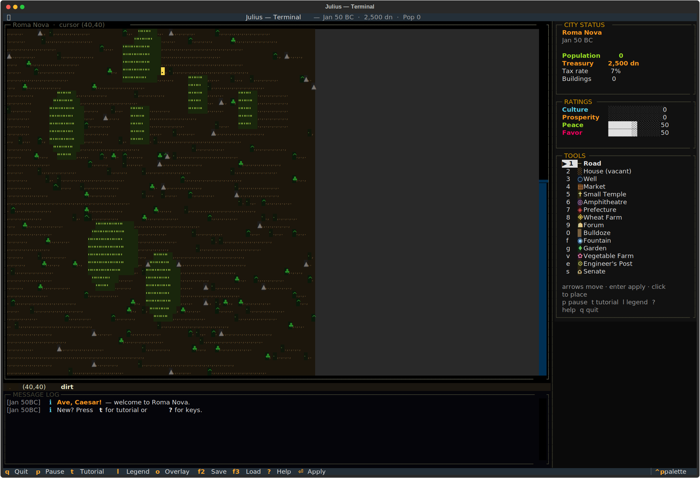

# julius-tui
Rome is built one turn at a time.




## About
Caesar demands a city. Build it, row by row, on an 80×80 scrollable map of tiled dust. Raise housing from tent to mansion. Pipe water from reservoirs. Balance the treasury against the four imperial ratings. Fifteen building types, a working economy, and a working save file — a clean-room Caesar III for the terminal.

## Screenshots


## Install & Run
```bash
git clone https://github.com/akakabrian/julius-tui
cd julius-tui
make
make run
```

## Controls
<Add controls info from code or existing README>

## Testing
```bash
make test       # QA harness
make playtest   # scripted critical-path run
make perf       # performance baseline
```

## License
MIT

## Built with
- [Textual](https://textual.textualize.io/) — the TUI framework
- [tui-game-build](https://github.com/akakabrian/tui-foundry) — shared build process
